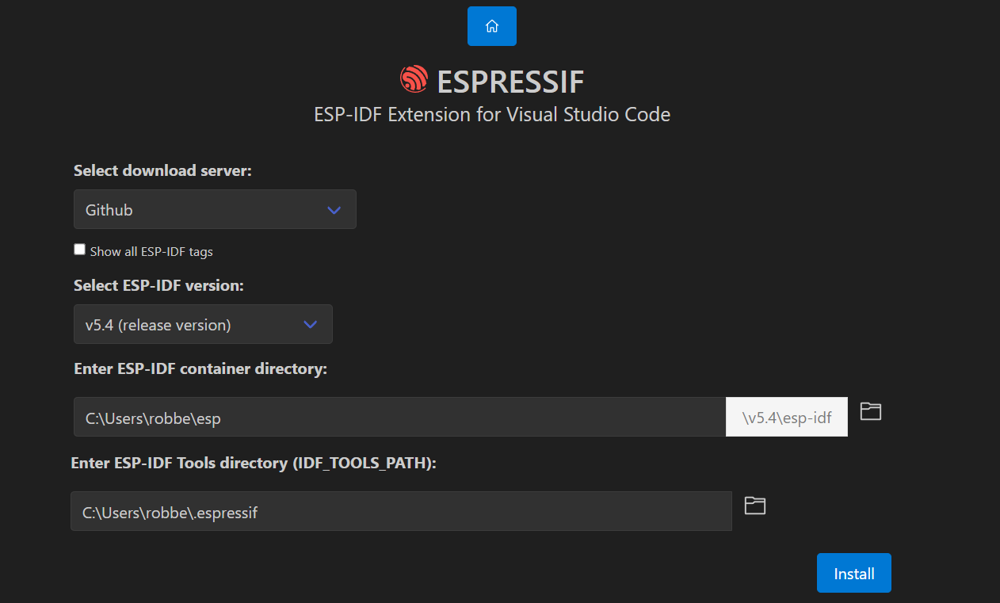
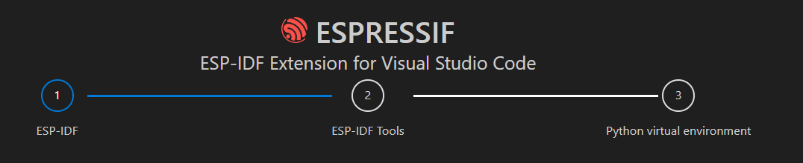

## TL;DR

If you have already set up the ESP-IDF development environment and want to
quickly start with Walter you can download our ESP-IDF library and run some
examples. All source code is available on Github: 
https://github.com/QuickSpot/walter-esp-idf

## prerequistes/setup
### vscode
#### ESP-IDF extension

to start with vscode you will need the 
[ESP-IDF](https://marketplace.visualstudio.com/items?itemName=espressif.esp-idf-extension) extension.

after installing the extension you will be prompted to setup the extension.

>select the latest ESP-IDF version and click install.


> after that the extension will install all necessary tools


#### install the walter-modem extension
after installing the extension you will have to install the [walter modem](https://components.espressif.com/components/dptechnics/walter-modem/) library

>vscode quikmenu command:
```
>ESP-IDF: Show ESP Component Registry
```

#### Device Target
after installing the walter modem extension the Device Target needs to be set to esp32s3 (this needs to be done for each project)
>vscode quikmenu command:
```
>ESP-IDF: Set Espressif Device Target
```
## examples
